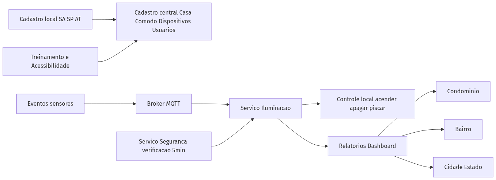
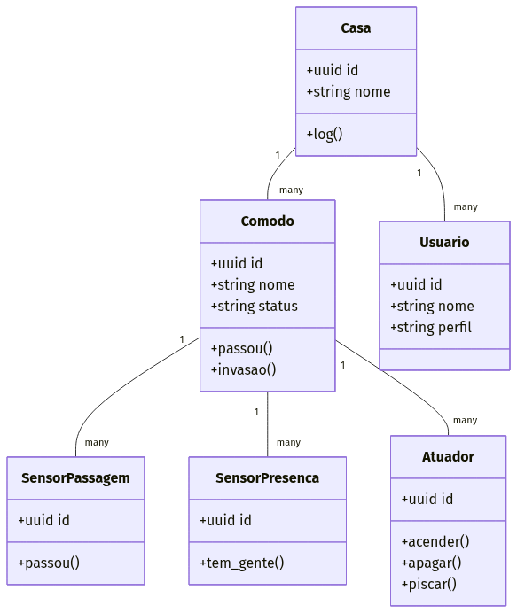
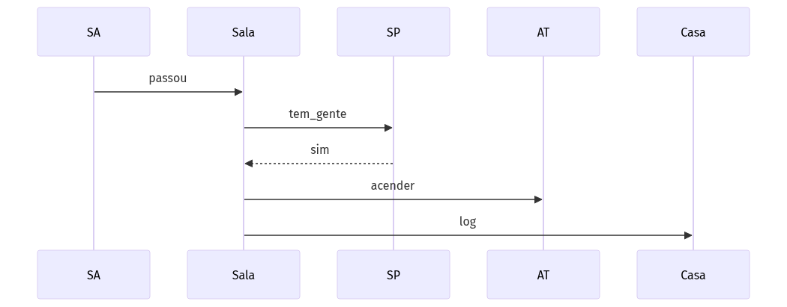
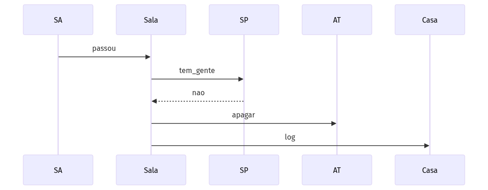
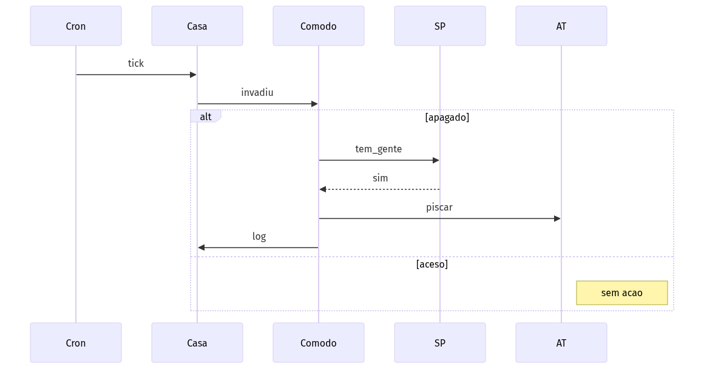
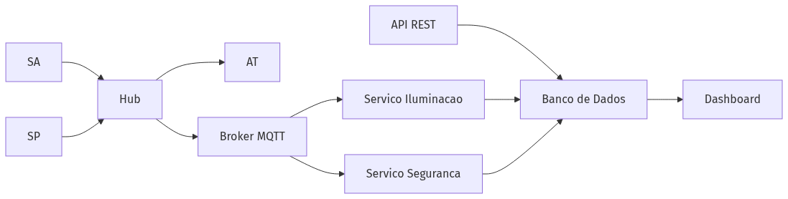
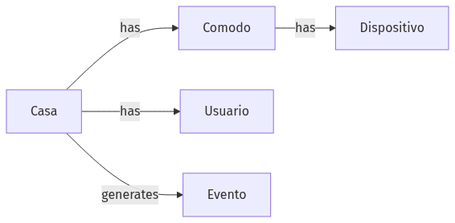

# Ponderada S1-ES07-2025 - Projeto — Automação de Iluminação para 10.000 Casas (Plataforma SaaS)

**Entrega da atividade (RM‑ODP)** — Modelagem de um sistema multiusuário que amplia o exemplo de **iluminação automatizada** para **10.000 casas**, coordenadas por uma **plataforma digital como serviço**. O foco é descrever as **cinco visões**: processo de negócio, requisitos funcionais e não funcionais, decisões de engenharia e tecnologias.

---

## Contexto e Objetivo

- **Problema**: hoje o controle acontece por residência isolada; precisamos escalar para *n* casas sob uma plataforma central, mantendo simplicidade e foco no **treinamento/acessibilidade** (business driver).
- **Objetivo**: documentar uma solução que **atende aos requisitos pedidos** na atividade, sem introduzir tecnologias desnecessariamente complexas.
- **Escopo**: controle de iluminação por cômodo; detecção de presença/invasão; relatórios agregados para condomínio/bairro/cidade; trilha de auditoria; suporte a perfis com **necessidades especiais** (voz, alto contraste, feedback tátil).

---

## Visão 1 — Business Drivers e Processo de Negócio

**Drivers principais**  
- Treinamento e **acessibilidade** para usuários com necessidades especiais.  
- Economia de energia e **conveniência** (acender/apagar automático).  
- **Segurança**: piscas em caso de invasão com ambiente vazio.  
- **Escalabilidade**: operar milhares de casas de forma padronizada.

**Processo (alto nível)**  
1) Cadastro da casa, cômodos e dispositivos (SA, SP, AT).  
2) Eventos de sensores chegam ao hub da residência e/ou ao broker.  
3) Serviço de Iluminação decide **acender/apagar/piscar**.  
4) Logs e relatórios são consolidados para os níveis (condomínio → bairro → cidade).  
5) Módulo de **treinamento/acessibilidade** oferece assistentes e guias.

---

## Visão 2 — Requisitos Funcionais (RF) e Modelagem

**RF1 — Cadastro** de casa, cômodo e dispositivos (SA=Sensor de Passagem, SP=Sensor de Presença, AT=Atuador/Lâmpada).  
**RF2 — Controle de Iluminação** por eventos:  
- Entrou alguém em cômodo vazio → **acender** luz.  
- Sai a última pessoa → **apagar** luz.  
- Cômodo vazio + presença detectada na varredura de 5 min → **piscar** (invasão).  
**RF3 — Relatórios** periódicos por residência e agregados.  
**RF4 — Treinamento/Acessibilidade**: comandos simplificados, mensagens claras, contraste e suporte a leitor de tela.  
**RF5 — Auditoria**: registrar cada decisão e comando enviado.

### Modelo Estático (UML — Classes)

### Modelagem Dinâmica (UML — Sequência)

**Cenário A — Sala vazia, entra uma pessoa (acende)**  

**Cenário B — Sai a última pessoa (apaga)**  

**Cenário C — Varredura a cada 5 min (invasão → piscar)**  

---

## Visão 3 — Requisitos Não Funcionais (RNF)

- **RNF1 — Escalabilidade**: suportar **10.000 casas**; dimensionamento por tópicos MQTT e serviços stateless.  
  *Critérios*: throughput mínimo de **200 msg/s** no broker; adicionar instâncias horizontalmente.
- **RNF2 — Disponibilidade**: 99,5% mês para os serviços centrais.  
  *Critérios*: health-check, retry/backoff, fila resiliente (QoS 1 no MQTT).
- **RNF3 — Segurança & LGPD**: criptografia em trânsito, segregação por residência, logs anonimizados.  
  *Critérios*: TLS entre hub↔plataforma; masking de dados pessoais em relatórios.
- **RNF4 — Observabilidade**: logs estruturados e métricas de eventos/latência.  
- **RNF5 — Usabilidade/Acessibilidade**: contraste mínimo, labels sem jargão, leitura por voz opcional.  
  *Critérios*: acessibilidade AA (WCAG) aplicada às telas de treinamento.

---

## Visão 4 — Decisões de Engenharia

**Componentes**  
- **Hub residencial** (edge simples): recebe eventos de **SA/SP** e aciona **AT** localmente; publica eventos no **broker**.  
- **Broker MQTT** (ex.: Mosquitto): roteamento leve de eventos.  
- **Serviço de Iluminação** (stateless): regras de acender/apagar/piscar.  
- **Serviço de Segurança**: varredura a cada 5 min, identifica invasão em cômodo vazio.  
- **API** (REST) + **Banco** relacional para cadastro, logs e relatórios.  
- **Dashboard/Relatórios**: consulta agregada por residência/condomínio/bairro/cidade.

**Dados (ER)**

---

## Visão 5 — Tecnologias (prototipagem)

- **Linguagem/Framework**: **Python (FastAPI)** ou **Node.js (Express)** — simples e conhecidos.  
- **Mensageria**: **MQTT (Mosquitto)**.  
- **Banco**: **PostgreSQL** (ou SQLite para demo local).  
- **Frontend/Dashboard**: páginas HTML simples ou **Metabase** para relatórios.  
- **Logs/Métricas**: stdout estruturado + contadores simples por serviço.

---

## Como rodar um protótipo mínimo (opcional)

1. Subir **Mosquitto** local (ou usar um serviço gerenciado).  
2. Executar a API (FastAPI/Express) com endpoints de cadastro e um worker de varredura (5 min).  
3. Simular eventos dos sensores publicando mensagens MQTT (tópicos por casa/cômodo).  
4. Verificar logs/relatórios.
